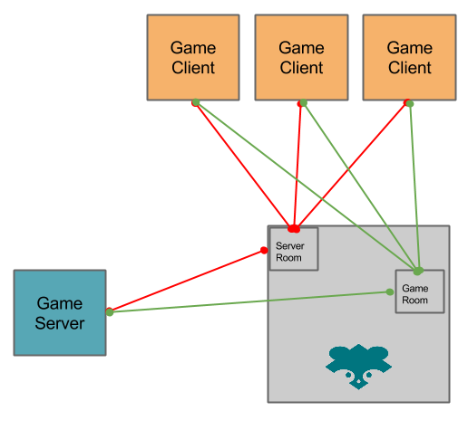

# Kuzzle Tournament - Tutorial

**Kuzzle Tournament** is a multiplayer combat game running in web browsers.

This is an advanced tutorial, meant to only explain these specific Kuzzle features:

* How to setup an application server working in pair with Kuzzle
* How to handle client disconnections

This tutorial uses the [Kuzzle Javascript SDK](https://github.com/kuzzleio/sdk-javascript)

**Table of content:**

* [Why another back-end server?](#why-another-back-end-server)
* [How does it work?](#how-does-it-work)
* [Handling disconnections](#handling-disconnections)


# Why another back-end server?

One of Kuzzle purposes is to handle communications between the different components of an application. Other tutorials show how to synchronize application clients, but here we wanted to show how Kuzzle can also handle communications between different components of an application.

**Kuzzle Tournament** is a good example of a multi-components application:

* the game client handles the graphical interface
* the game server manages rooms and game rules, and also starts and ends games
* Kuzzle handles the communications between these components

# How does it work?

There are several ways to add an application server to Kuzzle. The most natural way to do it for a simple client-server application is to interface a server between clients and Kuzzle, hiding Kuzzle from the application's clients.

In this demo, we adopted a different approach, by putting Kuzzle at the center of the communication flow between our game clients and the game server.  
We did this mainly because we wanted to show how Kuzzle can serve as a central point of communication between independent and different components of an application.

Here is how it looks like:




What happens when a new player starts a game is this:

1. The client subscribes to the server room, and sends a message with its informations
* The server gets the client message, search for an adequate game room or create one if needed, assigns the player to it and replies with the ID of the game room
* The client can then subscribe to the assigned game room, and start receiving and sending game updates


When the game server creates a new game room, it also subscribes to it in order to listens to the game updates, and to orchestrate how the game goes.

The game server is implemented in the following file: [server/tournament_server.js](server/tournament_server.js)

# Handling disconnections

Other tutorials cover Kuzzle notifications on documents, but there are two special kind of notifications, unrelated to documents:

* *New connection* notification
* *Disconnection* notification

These events are fired whenever someone enter or leave a room you're listening to. Be aware that a *room* is in fact a set of filters, so to receive one of these notifications, you need to use the same filters than the application entering or leaving the room.

In Kuzzle Tournament, the game server listens to the *Disconnection* notification in order to inform other players that someone left the game, and to make sure that enough player remain for the game to continue.  

Here is the code snippet managing a player disconnection. It is located line 36, in the callback function launched each time a message is received on the server room:

```js
if (data.action == 'off') {
	removePlayer(data.roomName);
}
```

And here it is. The ``removePlayer`` function simply handles the consequences of a player leaving the game.

To listen to *New connection* notifications instead, simply look for an ``data.action == 'on'`` message.

There is a trick, though. Since these two events are unrelated to documents, the data received is different from other notifications. Namely, these notifications do not contain any document information.

Here is how an ``on`` or ``off`` notification looks like:

```javascript
{
  error: null,
  result: {
    roomId: 'unique Kuzzle room ID',
    roomName: 'the exiting user room ID',
    controller: 'subscribe',
    action: 'off',                   // or 'on' for a new connection
    count: <the new user count on that room>,
  }
}
```

The game server has to use the ``roomName`` field to identify who exactly left the game. This ID is unique and serves as a subscription ID.  
Since this ID is generated when subscribing to a room, the game client sends it to the game server when asking for a game room. That's how the game server can know which player exactly left the game.

This is a bit of a hassle, so in future versions of Kuzzle, we plan to add subscriptions metadata, to help application designers to better handle this kind of problem by letting them add custom data along with these events.
